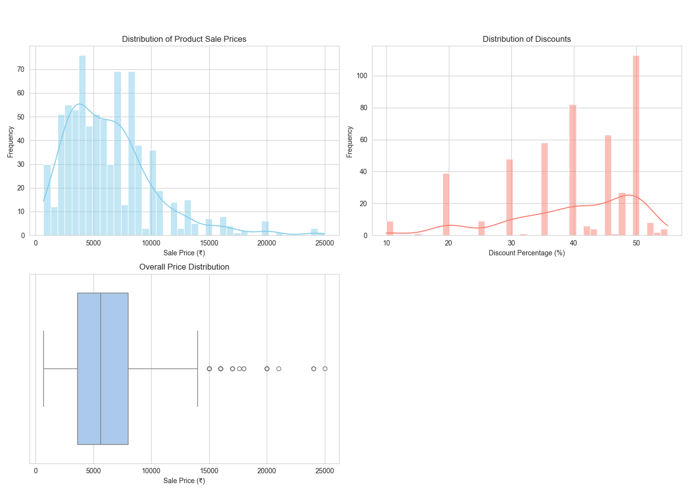

# Datahut-Data-Science-Internship-Task
# Puma Women's Footwear Scraper

### Objective

The goal of this project was to scrape product data for all items in the Women's Footwear category on the Indian Puma website. The final output is a clean, structured CSV file containing key product attributes for analysis. The project involves a two-phase scraping process, data storage in an SQLite database, and a final data cleaning step.

-----

### Scraping Approach

The scraper is built using Python and is modularized into several scripts for clarity and maintainability.

  * **Libraries Used**:

      * `Selenium`: To control a web browser for scraping pages that load content dynamically using JavaScript, such as the main product grid with its "infinite scroll" feature.
      * `BeautifulSoup`: To parse the HTML content from both the main grid and the individual product pages.
      * `SQLite`: To provide a robust, incremental storage solution. Data is saved to the database one by one to prevent data loss and to handle duplicates automatically.
      * `Pandas`: To export the final, clean data from the SQLite database into a CSV file and to perform data cleaning operations.

  * **Two-Phase Process**:

    1.  **Phase 1 (`phase1_scraper.py`)**: A Selenium-driven browser automatically scrolls to the bottom of the main category page to load all products. The basic information (name, URL, price, discount) for each product is scraped and saved to an SQLite database.
    2.  **Phase 2 (`phase2_scraper.py`)**: The script then scrapes the details (description, available sizes) by visiting each product URL saved in the database. This phase also uses Selenium to ensure all dynamically loaded content, like the sizes, is correctly captured. To improve speed, this phase uses a single, persistent browser session rather than opening a new one for each product.

-----

### Challenges Faced & How They Were Handled

  * **Challenge: Dynamic Content & Infinite Scroll**

      * The initial approach using the `requests` library failed because the product grid is not static HTML; it's loaded dynamically with JavaScript.
      * **Solution**: We switched to **Selenium** to automate a real web browser. This allowed the script to execute the JavaScript and render the full page. A "patient" scrolling loop was implemented to repeatedly scroll to the bottom of the page, ensuring all products from the "infinite scroll" were loaded before scraping began.

  * **Challenge: Dynamic Data on Product Pages**

      * While scraping the individual product pages, we found that a simple `requests` call could not retrieve the available sizes, as they were also loaded dynamically.
      * **Solution**: We made the engineering trade-off to use the more robust **Selenium** browser for the detail-scraping phase as well. This guarantees that all page content is fully rendered before extraction, ensuring 100% data accuracy.

  * **Challenge: Stale or Incomplete Data**

      * The script needed to be re-run multiple times for debugging. This led to issues where partially scraped data ("Not Found") was not being updated on subsequent runs.
      * **Solution**: The SQL query was refined to select products where details were either missing (`NULL`) or still marked as `"Not Found"`, making the script re-runnable and robust.

-----

### How to Run

1.  **Prerequisites**: Install the required Python libraries from your terminal.

    ```bash
    pip install selenium beautifulsoup4 pandas
    ```

2.  **WebDriver**: Download the appropriate `ChromeDriver` for your version of Google Chrome and ensure it is accessible in your system's PATH.

3.  **Execute**: Run the main script from your terminal to start the entire process.

    ```bash
    python scraper.py
    ```

    The script will create the database, run Phase 1 and Phase 2, clean the resulting data, and save the final, complete dataset as `final_dataset.csv`.

-----

## Analysis and Results

After scraping and cleaning the data, an analysis was performed to uncover insights into Puma's women's footwear offerings on the Indian website.

### Descriptive Statistics 

The statistical summary of the 770 products analyzed reveals several key points:
* **Pricing**: The average full price for a pair of shoes is approximately **₹8,372**, while the average sale price is **₹6,382**.
* **Discounts**: The average discount is **24.5%**. Interestingly, the 25th percentile is 0%, which means at least a quarter of the items are not on sale.
* **Range**: Prices range from a budget-friendly ₹999 up to a premium price of ₹24,999.

Here is the detailed breakdown:

| Statistic | Full Price | Discounted Price | Discount Percentage |
| :--- | :--- | :--- | :--- |
| **count** | 770.00 | 770.00 | 770.00 |
| **mean** | 8371.86 | 6382.43 | 24.54 |
| **std** | 4213.63 | 3850.24 | 20.96 |
| **min** | 999.00 | 699.00 | 0.00 |
| **25%** | 5499.00 | 3599.00 | 0.00 |
| **50%** | 7999.00 | 5599.00 | 30.01 |
| **75%** | 9999.00 | 7999.00 | 45.01 |
| **max** | 24999.00 | 24999.00 | 55.01 |


### Visualizations 

The `analyzer.py` script generates the following visual dashboard to summarize the findings:

* **Distribution of Sale Prices**: The histogram shows that most products are sold in the **₹3,000 to ₹8,000** price range.
* **Distribution of Discounts**: For items that are on sale, the most common discounts are clustered around **40-50%**.
* **Overall Price Distribution**: The box plot clearly shows the concentration of prices and identifies several high-priced outliers.



### Limitations

* **Website Structure Dependency**: The scraper's success is highly dependent on the current HTML structure and `data-test-id` attributes of the Puma website. Any changes to the site's front-end code could break the selectors and require an update to the script.
* **Missing Data at Source**: Ratings and review counts are not displayed on the product pages and are therefore not included in the final dataset. The scraper accurately reflects this by recording "Not Found," but it means the dataset is incomplete in this regard.
* **Performance**: The final, reliable version of the scraper uses Selenium for both phases to handle dynamic content. This approach is inherently slower than a `requests`-based scraper due to the overhead of running a full browser.
